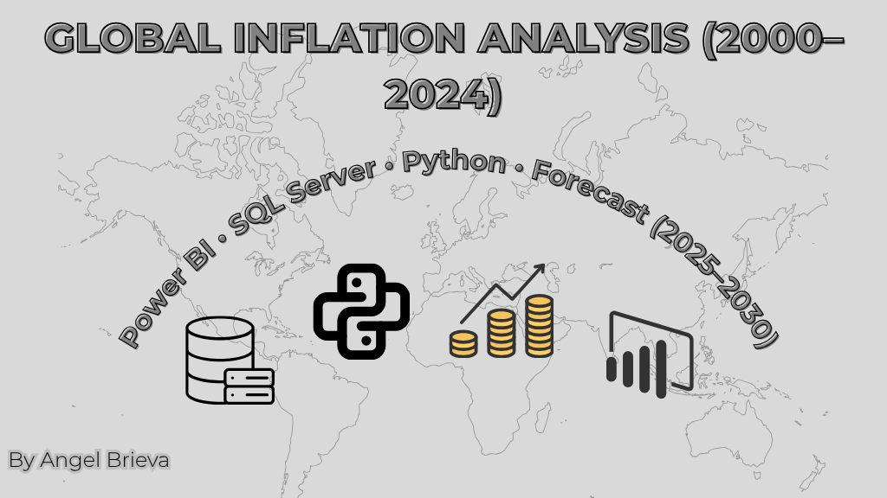

  

---

\## 🧰 Tools \& Technologies

| Tool        | Purpose                            |

|-------------|------------------------------------|

| Power BI    | Dashboard, KPIs, World Map, Trends |

| SQL Server  | Data storage \& filtering           |

| Python      | Forecast (2025–2030) using Prophet |

| DAX         | Measures, KPIs, dynamic visuals    |

| Git + GitHub| Version control \& portfolio        |

---

\## 📦 Dataset

\- \*\*Source:\*\* \[World Bank - Inflation, consumer prices (annual %)](https://data.worldbank.org)

\- \*\*Original Range:\*\* 1960–2025

\- \*\*Cleaned Range Used:\*\* 2000–2025

\- \*\*Format:\*\* `.csv`, with 3 key columns:

&nbsp; - `Country\_Name`

&nbsp; - `Year`

&nbsp; - `Inflation` (annual %)

---

\## 🔧 Data Cleaning \& Processing

\- Imported raw CSV with inflation data (1960–2025)

\- Transformed wide format → long format: `Country`, `Year`, `Inflation`

\- Removed missing values and standardized column names

\- Filtered to keep years \*\*2000–2025\*\*

\- Uploaded into \*\*SQL Server\*\* table: `GlobalInflation`

\- Exported cleaned CSV as `Global\_Inflation\_Cleaned.csv`

---

\## 📊 Power BI Dashboard

\### ✅ Key Visualizations

\- 🌐 \*\*World Map:\*\* Choropleth by inflation %

\- 📈 \*\*Line Chart:\*\* Global average inflation over time

\- 📊 \*\*Bar Chart:\*\* Top 10 countries by inflation

\- 📋 \*\*Data Table:\*\* Country-year view with conditional color

\- 📌 \*\*KPIs \& Cards:\*\*

&nbsp; - Global Avg. Inflation

&nbsp; - Max Inflation Value

&nbsp; - Year of Max Inflation

&nbsp; - Country with Max Inflation

&nbsp; - Count of Countries Analyzed

\### 🖼️ Sample Screenshot

!\[Power BI Dashboard](Dashboard\_Screenshots/PowerBI\_Overview.png)

---

\## 📈 Python Forecasting (2025–2030)

Using Facebook Prophet to predict average global inflation rates from 2025 to 2030.

\### Key Steps:

\- Grouped dataset by year to get global average

\- Used Prophet to model inflation trend

\- Forecasted 6 future years

\- Plotted actual vs. predicted in a time series chart

📷 \*\*Sample Output:\*\*

!\[Python Forecast](Dashboard\_Screenshots/Forecast\_Python.png)

---

\## 💡 Key Insights

\- 🔥 Inflation peaked in \*\*2020\*\* — driven by post-pandemic economic stress.

\- 🌍 Countries like \*\*Zimbabwe\*\*, \*\*Argentina\*\*, and \*\*Sudan\*\* recorded the highest average inflation.

\- 📉 Stable economies (e.g., Western Europe, Japan) maintained inflation rates below 3%.

\- ❗ \*\*Venezuela\*\* and \*\*Cuba\*\* had major data gaps due to reporting issues.

---

\## 🧠 Lessons Learned

\- Used DAX formatting techniques to fix inflation display in %  

\- Improved Power BI storytelling with dynamic titles, tooltips, and KPI design  

\- Built a predictive model with Prophet and learned how to export and visualize results  

---

\## 🚀 How to Use

1\. Open the `.pbix` file with Power BI Desktop

2\. Explore visuals with filters (by year)

3\. Run the `Forecast.py` script to see the prediction

4\. Replace `Global\_Inflation\_Cleaned.csv` if updating data

5\. Use the GitHub repo to fork, clone, or contribute

---

\## 📬 Author

\*\*Angel Brieva\*\*  

📧 brguille23@gmail.com 

📅 June 2025

---

⭐ \*If you like this project, give it a star!\*

